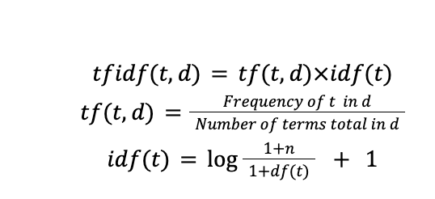

#Machine Learning Group Project Fall 2022: Testing and Optimizing Various Machine Learning Algorithims for Suicide Ideation Detection
## Meet the Team

Liv: 4th Year CS Major with People & Intelligence Threads  
Eli: 4th Year CS Major with People & Intelligence Threads  
Dan: 3rd Year CS Major with People & Intelligence Threads  
Liz: 3rd Year CS Major with Device & Intelligence Threads  

Former Member Ric:   4th Year CS Major with Media & Intelligence Threads  

## Project Proposal Video: https://youtu.be/r-2KxHIcPFs
## Final Report Presentation Video: https://youtu.be/2g0yPqXu4N4
## Final Report

**Introduction & Background**

Our team utilized machine learning for the purpose of sentiment analysis on social media posts. Specifically, we used a database of over 300,000 reddit posts, which have been labeled for suicidal content, in order to train a machine learning model to recognize suicidal social media posts. Our dataset can be found on Kaggle here: https://www.kaggle.com/datasets/nikhileswarkomati/suicide-watch

Some existing research has delved into the use of Naive Bayes Machine Learning algorithm for sentiment analysis on Reddit posts to analyze them for suicidal content. One study found that the Naive Bayes model performed better than an SVM model and an ensemble model at binary-classification tasks such as distinguishing between posts flagged as either risk of suicide or no risk of suicide (Ruiz et al., 2019). Another found that the Naive Bayes model was outperformed by a Support Vector Machine model, a Random Forests model, and a Long Short Term Memory Convolutional Neural Network when classifying suicidal Reddit posts (Tadessee al., 2019). A third study found that Naive Bayes had the best Macro F1 score (a type of accuracy measurement) out of 11 different Machine Learning algorithms when performing this task (Kumar et al., 2021).

**Problem Definition**

Although there is pre-existing research comparing models for classifying suicide ideation from text analysis, there is a lack of comparison between the standard bag of words feature extraction technique with other techniques such as N-grams, and TF-IDF. Thus, it is important to analyze the performance of identifying suicide ideation with various models such as Naive Bayes, Logistic Regression, and Random Forest, along with various feature extraction techniques such as TF-IDF, bag of words, and N-grams.

**Data Collection**

The pre-existing research which uses Naive Bayes to classify suicide ideation makes it clear that while it can be successful in certain respects, there are still areas to be optimized such as increasing the range of application of detection models. However, it must be compared with other models such as Logistic Regression and Random Forest using a variety of metrics as existing research indicates it is often outperformed by other models.

**Methods**

*Pre-Processing* 

During the text pre-processing stage, the Reddit post data was tokenized, stemmed and filtered for stop words. Specifically, we included the following pre-processing methods before conducting any further analysis in the following order: Convert Contractions/Abbreviations/Acronyms into Words, Remove Punctuation, Remove Emojis and URLs, Tokenization, Stemming, Stop Words (removal), and Lowercase Text (convert to). Removing Contractions/Abbreviations/Acronyms also removes gibberish. All resources we referenced for pre-processing are linked at the bottom of the report.
The stemming method combines like terms together, which is a form of dimension reduction. For example, words such as “running” and “run” have similar meanings, but just in different forms. Stemming would group these words together into the same token. By reducing the variety of words that have the similar meaning, the quality of the data is significantly improved upon since the weight of the tokens will become more representative of the meaning of the words rather than just raw word frequency. See the figures and captions below for evidence of our data pre-processing.

*Figure 1.1 No Contractions, No Punctuation, No Emojis/URLS, Tokenization*

The images above demonstrate what our data looked like before and after preprocessing. The column titled “raw” is the original data before any pre-processing. The last column is the most “clean version” of the data. Meaning, every following column to the right becomes more and more “clean” (e.g. the no_punctuation output also has no contractions). The highlights in Figure 1.1 and Figure 1.2 indicate specific examples of each of the preprocessing methods.

*Discussion: Flaws in Dataset and Preprocessing*

There are several flaws with this dataset which limit the efficacy of our model. Due to the nature of social media posts, this dataset is rife with the use of slang, emojis, URLs, acronyms, gibberish, and other confounding factors which makes the data difficult to process. While we were able to account for many of these aspects with our data preprocessing (see Figures 1.1 and 1.2 above), we were likely unable to entirely account for all these issues, meaning our cleaned data which the model was trained with may have still been somewhat flawed and thus could have yielded inaccuracies.
Furthermore, there were certain flaws with the collection of data which resulted in some potentially meaningful words being effectively lost. We believe that when collecting data, the creators of the dataset did not put spaces between the last word of a post’s title and the first word of the post’s content, resulting in words being fused in several posts. Therefore, we may be losing some highly significant words, like “suicidal,” because a post’s title ended with the word and had more text within the body of the Reddit post. In some of these cases our data preprocessing is likely recognizing these fused words as gibberish, but as shown below, this is not always the case. See Figure 2.1 for an example of the “gibberish” merged words in the cleaned dataset.

Here, the title of the post is “Ex Wife Threatening Suicide”. However, no space is added between this title and the first word of the post, so the word “Suicide” becomes merged with “Recently” to become “SuicideRecently”. This word is still included in the cleaned dataset, which in this case especially, removes weight from the important word “suicide”. It was not recognized as gibberish and thus remained in the dataset.

Although there is a possibility of losing significant words or including “gibberish” in the dataset due to the spacing error, the overall impact is minimal because the merged word is unlikely to repeat multiple times in other comments. The other issues with the data should only serve as noise and not have a significant impact on accuracy.

*Exploring Most Frequent Tokens*

The Naive Bayes implementation for this project uses a frequency table of tokens for both Suicidal and Non-Suicidal posts. These are the tokens generated from the cleaned data described in the previous section. The figures below show the top 25 most frequent tokens for both kinds of posts
 

Here are a few interesting points to note here about the most frequent tokens:
1. For Suicidal Posts, “life”, “think”, “friend”, “fuck”, and “live” are among the top 25 most frequent tokens. Besides “fuck”, the other three words are generally considered either positive or neutral on their own. This indicates the context in which these words are used becomes very important. For example, we can assume that the high occurrence of the token “friend” in the suicidal posts most likely relates to the person expressing a lack of friends or a desire for more friends.
2. For Non-Suicidal Posts, “fuck”, “friend”, “think”, “school” are among the top 25 most frequent tokens. The overlap in the most frequent tokens with the Non-Suicidal Posts may simply indicate that these are just common topics for Reddit posts. Thus, token frequency alone cannot tell us much in terms of predicting Reddit post suicidal content.

*Implementation of  Logistic Regression, Naive Bayes, TF-IDF, and Random Forest*

After the data was preprocessed into tokens, TF-IDF and N-grams would be implemented in various combinations of feature extraction techniques. The absence of TF-IDF will be referred to as the standard “Bag of Words” and bigrams from hereinafter will be inclusive of unigrams. The following table shows all the combinations of  feature extraction methods:

Because Random Forest requires a high computation time, only the bag of words and unigrams training data was used for that model.
The term frequency-inverse document frequency (TF-IDF) is applied to the training data to emphasize more impactful words that appear frequently in a single comment, while reducing the impact of words that appear frequently in all comments such as “much” and “so”. This is done by multiplying the term frequency with the inverse document frequency.

 

For N-grams feature extraction, the standard single frequency tokens known as unigram would be implemented for all models; however, it is also important to use bigrams which tokenizes the sequences of two words rather than a single word. Trigrams were not implemented because the computational cost would be too high and the benefits would be minuscule (since each extra gram would increase the computational time exponentially). 
The multinomial Naive Bayes model was set up by using the scikit-learn package MultinomialNB. A laplace smoothing of 1.0 was used to reduce the weight of words that appear zero times conditionally. This model is the most time efficient because it only needs to multiply all of the conditional probabilities of each word (feature) and the prior probability to the prior probability for each respective classification. 
This same training data was also used to train the Logistic Regression model. Logistic Regression is a machine learning model which is also often used for binary classification tasks. It is a statistical model which uses a logistic function to model conditional probability. This model was run for a maximum of 3000 iterations on the training data before being run on the testing data and compared to the ground truth labels. After testing with various powers of inverse regularization scores, the score of 1 was used to maximize run time and accuracy. The logistic fit took around ~2000 iterations to converge. If larger data sets are used in the future, the score could be brought down to e-1. This would bring the iterations to below 300 at a 1-2% cost loss in accuracy.
This same training data was also used to train the Random Forest model by using the scikit-learn package RandomForestClassifier. This type of model uses a collection of decision trees and subsequent random samples of the data to predict classification. We ran this model with the default parameters, except for num_estimators. We tuned this hyper-parameter to be equal to 10 and 50, and compared the two accuracies.

**Results & Discussion**

In order to determine the success of our project, our primary metric is percent accuracy in predicting if posts contain suicidal content. Accuracy is the most important metric for us to collect because both false positives and false negatives could have drastic effects for the health and safety of those involved in the posts. 
Our Naive Bayes approach using TF-IDF was able to achieve 88% accuracy, which was measured by comparing the predicted labels to the ground truth labels from the testing dataset (which as previously indicated, had an about 50-50 split in suicidal and non-suicidal posts). We also analyzed the true positive rates, true negative rates, positive precision, and f1 scores of the Naive Bayes model, as well as the Logistic Regression model, using both the bag of words and TF-IDF approaches to prepare the training data for these models. The results are shown in the tables and charts below:

*Takeaways:*
1. Across both bigrams and unigrams, Logistic Regression outperforms Naive Bayes for all metrics excluding true positive rate.
2. TF-IDF does not have a significant difference on the performance of Logistic Regression, but makes an improvement (albeit still small) on the accuracy of the Naive Bayes model for all cases except the true positive rate. This holds for both the bigrams and unigrams charts.
3. The difference between the accuracy score and f1 score within each model is almost identical because our data’s ground truth labels are balanced.
4. These takeaways are for both unigram and bigrams - we breakdown the more subtle unigram vs bigram differences below.

*Takeaways:*

1. We ran our models using both bigrams (two word tokens) and monograms (one word tokens). When comparing Charts 1 and 2, there is **not a significant change in accuracy for logistic regression for monograms vs bigrams.** 
2. For **Naive Bayes, monograms performed slightly higher in accuracy** than the dataset with bigrams. This applies to both the Bag of Words and TFIDF implementations. 
3. A more subtle note is that for Bag of Words Naive Bayes, the unigram model yielded over 77% true negative rate, while the bigram model gave only a 69% true negative rate. 

*Random Forest Discussion*

As seen below, when the num_estimators was 10 for the Random Forest Model (with Bag of Words), the accuracy is 86%, which is the worst performance of any other models discussed previously in this report. 

We tuned this hyper-parameter to have  num_estimators to equal 50 and the accuracy improved almost 3% to be 89% accurate overall. We were not surprised by this increase in accuracy because increasing the number of trees in the forest gives the model more classifiers to use in the prediction. The risk with increasing the number of trees is potentially overfitting and greater computational cost. We tried to strike a balance. 

**These final charts and takeaways below present just the accuracy rates for all variations of the models used and attempt to summarize the results section.**

Takeaways:

1. The highest accuracy was achieved by TF-IDF Bigram Logistic Regression at 93.34%, followed by Bag of Words Bigram Logistic Regression at 93.32%, followed by Bag of Words Monogram Logistic Regression at 92.82%
2. The lowest accuracy was achieved by Bag of Words Multinomial Naive Bayes at 84.24% accuracy.
3. Accuracies ranged from ~84% to ~93% across all models tested

**Conclusion** 

**In respect to all metrics excluding true positive rate, the Logistic Regression model outperformed the Naive Bayes model. The Random Forest Bag of Words implementation performed slightly better in overall accuracy than Naive Bayes and worse than Logistic Regression for all implementations.**

Furthermore, TF-IDF did not have a significant impact on the Logistic Regression model’s performance when compared to its performance using Bag of Words, while Naive Bayes performed better on all metrics except for true positive rate when the TF-IDF approach was utilized (for both unigram and bigram). Naive Bayes is overestimating positive results, as evidenced by the high true positive rate, low true negative rate, and relatively low f1 score. Future research could look into how to reduce this overestimating positive results in Naive Bayes for these posts, perhaps taking place in the pre-processing step.
This trend is similar for our analysis of unigrams vs bigram tokens in our dataset. There is not significantly higher accuracy for using bigrams vs unigrams for Logistic Regression, but using unigrams for Naive Bayes (with either TF-IDF or Bag of Words) produces a slightly higher accuracy.
In general, Logistic Regression appears to be less sensitive to changes in the pre-processing of data (e.g. TF-IDF vs Bag of Words, unigrams vs bigrams) than Naive Bayes, which may contribute to its overall better performance.

For future research, we suggest looking at how preprocessing the data with trigrams affects the accuracy rates. We anticipate this would only impact Naive Bayes, due to the lack of significant impact of unigrams vs bigrams for Logistic Regression. It would also be interesting to research a better feature extraction method tailored for suicide ideation classification. Previous research compared Naive Bayes and SVM, so it would be interesting to see if SVM would perform better than our implementation of Logistic Regression. 

**Coding References**

*Pre-Preprocessing:* 

https://towardsdatascience.com/how-to-preprocess-social-media-data-and-text-messages-b011efacf74

https://www.researchgate.net/publication/336824895_Effective_Text_Data_Preprocessing_Technique_for_Sentiment_Analysis_in_Social_Media_Data

https://www.analyticsvidhya.com/blog/2021/06/text-preprocessing-in-nlp-with-python-codes/ 

https://www.geeksforgeeks.org/nlp-expand-contractions-in-text-processing/

https://medium.com/coinmonks/remaking-of-shortened-sms-tweet-post-slangs-and-word-contraction-into-sentences-nlp-7bd1bbc6fcff

https://realpython.com/sentiment-analysis-python/

https://www.geeksforgeeks.org/text-preprocessing-in-python-set-1/ 

https://medium.com/@tusharsri/nlp-a-quick-guide-to-stemming-60f1ca5db49e

https://www.educative.io/answers/how-to-remove-emoji-from-the-text-in-python

https://medium.com/analytics-vidhya/text-processing-tools-i-wish-i-knew-earlier-a6960e16a9c9

https://bobbyhadz.com/blog/python-remove-url-from-text#:~:text=sub()%20method%20to%20remove,replacing%20them%20with%20empty%20strings. 

*Naive Bayes:* 

Documentation:(https://scikit-learn.org/stable/modules/generated/sklearn.naive_bayes.MultinomialNB.html#sklearn.naive_bayes.MultinomialNB)

*Logistic Regression:*

Documentation:(https://scikit-learn.org/stable/modules/generated/sklearn.linear_model.LogisticRegression.html)
Example: (https://medium.com/analytics-vidhya/applying-text-classification-using-logistic-regression-a-comparison-between-bow-and-tf-idf-1f1ed1b83640)

*Random Forest:* 

Documentation (https://scikit-learn.org/stable/modules/generated/sklearn.ensemble.RandomForestClassifier.html) 
Example (https://www.datacamp.com/tutorial/random-forests-classifier-python) 

**Bibliography**

Kumar, A., Trueman, T. E., & Abinesh, A. K. (2021). Suicidal risk identification in social media. Procedia Computer Science, 189, 368–373. https://doi.org/10.1016/j.procs.2021.05.106

Ruiz, V., Shi, L., Quan, W., Ryan, N., Biernesser, C., Brent, D., & Tsui, R. (2019). Predicting Suicide Risk Level from Reddit Posts on Multiple Forums. Proceedings of the Sixth Workshop on Computational Linguistics and Clinical Psychology. https://doi.org/10.18653/v1/w19-3020

Samal, B., Behera, A. K., & Panda, M. (2017). Performance analysis of supervised machine learning techniques for sentiment analysis. 2017 Third International Conference on Sensing, Signal Processing and Security (ICSSS). https://doi.org/10.1109/ssps.2017.8071579

Tadesse, M. M., Lin, H., Xu, B., & Yang, L. (2019). Detection of Suicide Ideation in Social Media Forums Using Deep Learning. Algorithms, 13(1), 7. https://doi.org/10.3390/a13010007

### Updated Contribution Chart

| Name | Contributions |
|:-----|:--------------|
| Elijah Kessler | For the final: Created data visualizations comparing performance of our models. Updated the problem definition, implementation, and results and discussion sections. Recorded the introduction, existing research, and problem definition sections of the video. For the midterm: Completed and coded 2 pre-processing tasks (Remove Punctuation, Remove Acronyms) and processed the dataset from original csv into Python dictionary for pre-processing. Wrote the "Flaws in Dataset" section of the midterm report. For the proposal: Wrote the introduction, literature review, and assisted with the problem definition. Created the GitHub page and added everyone's contributions to it. |
| Olivia Mauger | For the Final Report: Coded Random Forest model and analysis, collecting preprocessing examples for report, exploring most frequent tokens chart and analysis, editing the discussion section, conclusions section for report and video. For the midterm: Completed and coded 3 pre-processing tasks (Remove Emojis, URLs, and to Lowercase), edited and helped with discussion on pre-processing errors & For the proposal: Helped with creating GitHub page and styled it using Markdown, recorded video and uploaded to YouTube, wrote Potential Results & Discussion section with Liz |
| Daniel Ling |For the Final Report: Coded Logistic Regression Model, coded all accuracy statistics calculations (false positive, false negative, etc), coded monogram and bigram analysis for Logistic Regression and Naive Bayes, implementation section of report.  For the midterm: Coded Naive Bayes Method, Converted data into TD-IDF scores, Converted data into Frequency Table, wrote about the implementation of Naive Bayes and TD-IDF, and also wrote more details about stemming. For the proposal: Researched Naive Bayes and pre-processing for sentiment analysis, Met TA to check on project idea, Researched Naives Bayes Transfer Learning, Wrote the Methods Section, wrote problem statement with Eli |
| Liz Huller | For the Final: Recorded the data collection and preprocessing sections of the video. Investigated the effects of the removal of stop words on the accuracy metrics.  For the midterm: Completed and coded 3 pre-processing tasks (Stemming, Stop words, tokenization). Wrote the ways of optimizing naive bayes section of the midterm report. For the proposal: Researched Naive Bayes and other methods for sentiment analysis, worked with Olivia on Potential Results & Discussion section, helped plan video, and added dates/assigned names to the Gantt Chart |
| Eric Zhang (Dropped Course on Oct 27, 2022) | Found the labeled data set for suicidal reddit posts. Researched the Naive Bayes Model and contributed to the methods section. Created visuals for the video presentation.  

